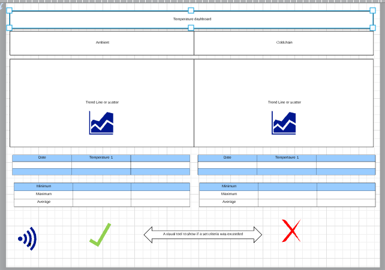

# TEMPERATURE MONITORING DASHBOARD

## This dashboard will show a tempertaure dataSet in a trend and summary format. Tempertaure data can be recorded using a mutlitute of sensors.The way the data is displayed is kust as important for the understanding and realtime analyse of the data. 

### This dashboard will utilise visualisation tools to display the temperature dataset in an manner which is easily understood at a glance. There will also be tools to summarise what the dataset is saying. With temperature the ability to show average, minimum and maximum values is essential in making the data useful.
### As a user of as temperature dashboard I want to see the trend across a set period of time. I also need to be able to download the data and view the dashboard for specific time periods and events.

 

##### Why does the wireframe not load?

