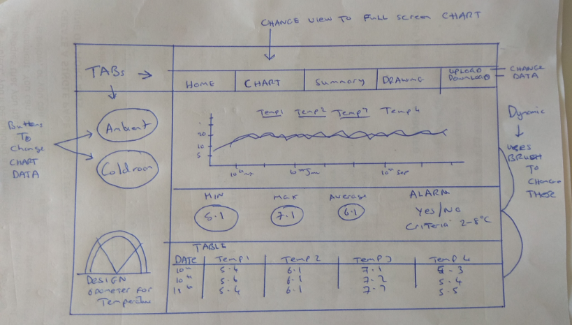

# TEMPERATURE MONITORING DASHBOARD

### The temperature profile of a space can be recorded using multiple sensors.The way the data is displayed is just as important for the understanding and realtime analyse of the data. 

This dashboard will utilise visualisation tools to display a temperature dataset in an manner which is easily understood at a glance. There will also be tools to summarise what the dataset is saying. With temperature the ability to show average, minimum and maximum values is essential in making the data useful.

As a user of this temperature dashboard I want to see the trend across a set period of time. I also need to be able to download the data and view the dashboard for specific time periods and events within the range of data available.

### Mockup below

### Description of project: There are two sets of data
* coldroom (coldroom.csv)with four rows of data (temp1,temp2, temp3 and temp4), the tempertaure range is 0-10°C
* ambient room (ambient.csv) with four rows of data (temp1,temp2, temp3 and temp4), the tempertaure range is 0-30°C

`
The dataset I have chosen has four sensors per room showing on the csv as four rows with data recorded in datetime incriments of 10 minutes for a six month period. There are also two csv files with one day of data to use in developement as the six months of data is slow to load
`

The design of the dashboard should incorperate both composite line graphs and scatter graphs interchangeable using a button or tab.

## UX

The user should login to see a page with a composite line chart of all the temperature readings from the csv.

There will be dynamic features like selectors and brushes to focus on data within the range.

The option to create bespoke charts using simple dropdowns will allow this focus

An option to save and down load the bespoke information

Reset or update button

Option for picture of sensor locations and labels, simple drawing? 

## Features
The page will have four distinct grids with the primary grid showing the graphs

Top row will be simple with option to show either of the rooms, this option can be a button or a tab

Second row will have the composite charts with all four sensors, or all eight (sample both) if possible

Third row should have summary data displayed in a table or icons with numbers. This will include an option for all data in a table and downloadable (simple href)

Fourth row down also could be left sidebar should have more dynamic dropdowns or selectors to create charts with individual lines from single rows across time periods of the suers choosing.
Options to create downloadable charts and tables for set data.

## Technologies Used
Bootstrap
D3.js
DC.js
Crossfilter

## Testing
One the design and draft is in place the testing will include changing the dataset.
The code should be written in such a way as to allow new tempertaure datasets to be loaded after the fact.

Is there an option to create output in such a way as to confirm that the original dataset was not adapted or altered in any way (Part 11 CFR21 compliant)

## Deployment
Review jasmine testing section for options
Is SASS required? 

Learn and deploy the DC.js charts first, then the table an brush options. Using Jquery for query selector buttons and dropdowns.

Start with short dataset and deploy with six months (4000+ lines)

## Credits

The creation of this dashboard will be carried out using the information provided by the code institute lessons/tutors and the Mentor 

## Media and Acknowledgement